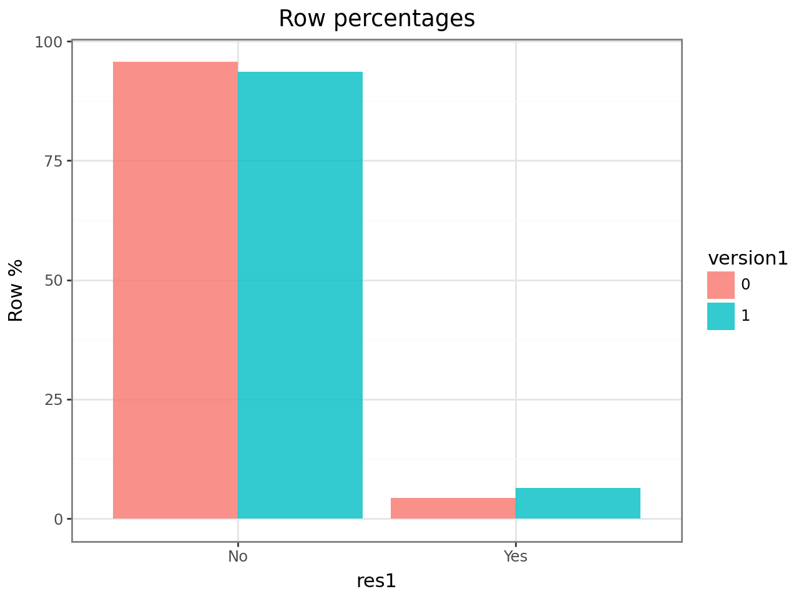
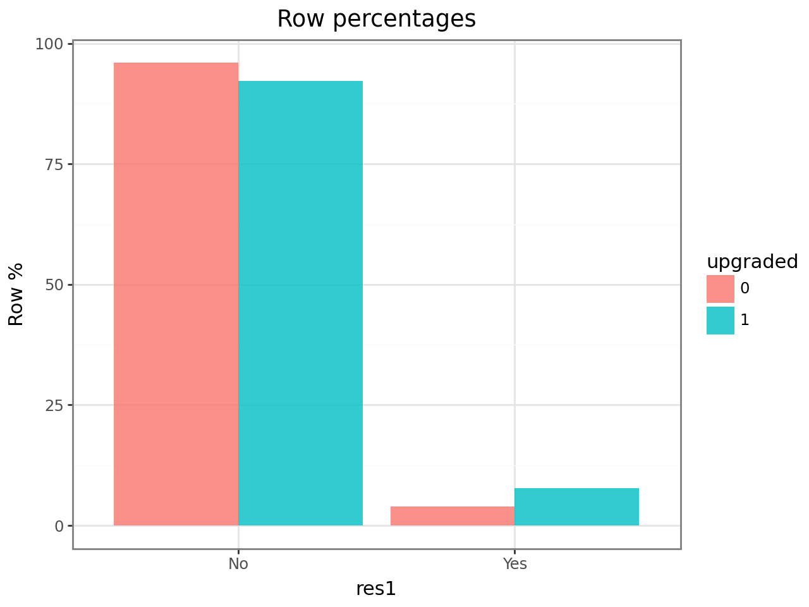
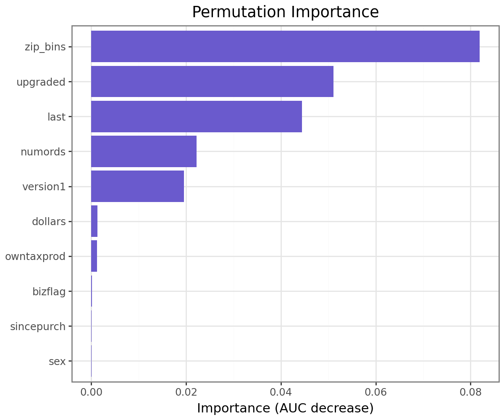
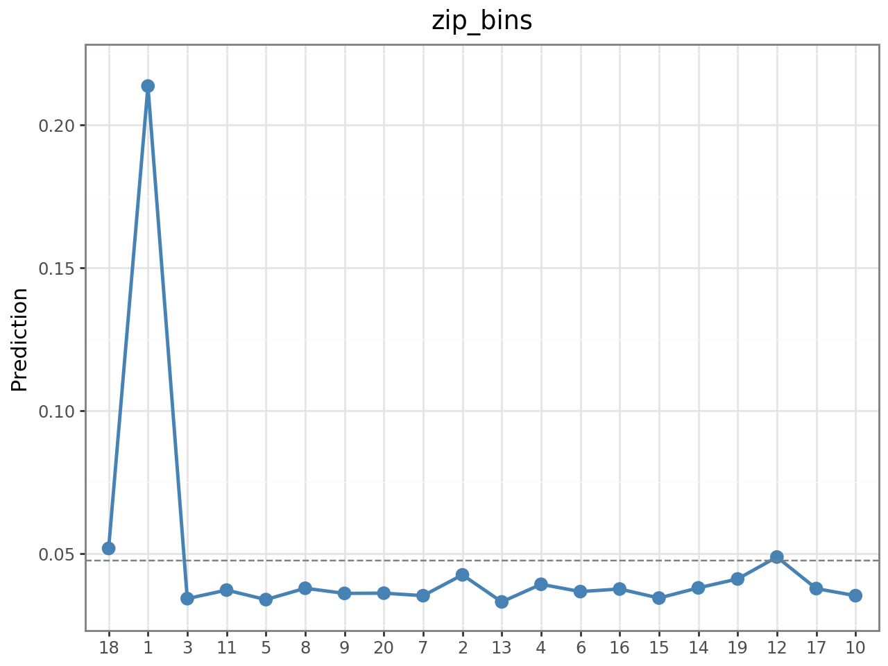

Intuit mailed 75,000 existing customers upgrade offers for QuickBooks. With a mailing cost of **\$1.41** and a margin of **\$60 per response**, the break-even response rate is just **2.35%** — meaning most customers are unprofitable to contact. The goal of this project is to build a targeting model that maximizes expected profit by identifying the right customers to mail in Wave 2.

---

## Data

The dataset contains 75,000 customer records with purchase history, demographic, and geographic features.

```python
intuit75k = pl.read_parquet("data/intuit75k.parquet")
intuit75k.head()
```

```
shape: (5, 15)
┌─────┬───────┬──────────┬─────────┬───┬──────────┬──────┬──────────┬──────────┐
│ id  ┆ zip5  ┆ zip_bins ┆ sex     ┆ … ┆ upgraded ┆ res1 ┆ training ┆ res1_yes │
╞═════╪═══════╪══════════╪═════════╪═══╪══════════╪══════╪══════════╪══════════╡
│ 1   ┆ 94553 ┆ 18       ┆ Male    ┆ … ┆ 0        ┆ No   ┆ 1        ┆ 0        │
│ 2   ┆ 53190 ┆ 10       ┆ Unknown ┆ … ┆ 0        ┆ No   ┆ 0        ┆ 0        │
│ 3   ┆ 37091 ┆ 8        ┆ Female  ┆ … ┆ 1        ┆ Yes  ┆ 1        ┆ 1        │
└─────┴───────┴──────────┴─────────┴───┴──────────┴──────┴──────────┴──────────┘
```

Key variables: `zip_bins` (ZIP-level income/density cluster), `version1` (owns v1), `upgraded` (previously upgraded), `numords` (order count), `last` (months since last order), `res1` (Wave-1 response — our target).

The business constraints define the model objective:

```python
MAIL_COST = 1.41
MARGIN_PER_RESPONSE = 60.0
DROP_FACTOR = 0.5          # Wave-2 response rate drops ~50% vs Wave-1

breakeven = MAIL_COST / MARGIN_PER_RESPONSE   # = 0.0235
```

Only mail customers where predicted response probability × 0.5 > 2.35%.

---

## Exploratory Data Analysis

Before modeling, we examined which features are most associated with responding (`res1 = "Yes"`).

**Version 1 ownership** is a strong signal — customers on v1 have a noticeably higher response rate, since they have the most to gain from upgrading:

```python
ct = rsm.basics.cross_tabs({"intuit75k": train_df}, "version1", "res1")
ct.summary(output="perc_row")
ct.plot(plots="perc_row")
```

{width=75%}

**Prior upgrade history** is even more discriminating — customers who have upgraded before respond at nearly twice the base rate. This suggests upgrade behavior is sticky:

```python
ct = rsm.basics.cross_tabs({"intuit75k": train_df}, "upgraded", "res1")
ct.plot(plots="perc_row")
```

{width=75%}

Both variables will be key features, and their interaction with each other (and with recency) motivated our feature engineering step.

---

## Feature Engineering & Model

We fit a logistic regression with interaction terms to capture non-linear relationships:

```python
# Interactions: upgrade behavior interacts with recency and order frequency
train_df = train_df.with_columns([
    (pl.col("numords") * pl.col("version1")).alias("numords_version1"),
    (pl.col("last")    * pl.col("version1")).alias("last_version1"),
])

clf = rsm.model.logistic(
    data={"intuit75k": train_df},
    rvar="res1", lev="Yes",
    evar=[
        "zip_bins", "numords", "dollars", "last",
        "version1", "owntaxprod", "upgraded",
        "zip801", "zip804",
        "numords_version1", "last_version1"
    ]
)
clf.summary()
```

```
Logistic regression (GLM)
Response variable    : res1
Level                : Yes
Explanatory variables: zip_bins, numords, dollars, last, version1,
                       owntaxprod, upgraded, zip801, zip804,
                       numords_version1, last_version1

┌──────────────────┬────────┬─────────┬─────────────┬───────────┬─────────┬─────────┬─────┐
│ index            ┆ OR     ┆ OR%     ┆ coefficient ┆ std.error ┆ z.value ┆ p.value ┆     │
╞══════════════════╪════════╪═════════╪═════════════╪═══════════╪═════════╪═════════╪═════╡
│ zip_bins         ┆ ...    ┆ ...     ┆ ...         ┆ ...       ┆ ...     ┆ < .001  ┆ *** │
│ upgraded         ┆ 1.821  ┆ +82.1%  ┆ 0.600       ┆ 0.071     ┆ 8.44    ┆ < .001  ┆ *** │
│ version1         ┆ 1.543  ┆ +54.3%  ┆ 0.434       ┆ 0.065     ┆ 6.68    ┆ < .001  ┆ *** │
│ last             ┆ 0.982  ┆ -1.8%   ┆ -0.018      ┆ 0.003     ┆ -5.91   ┆ < .001  ┆ *** │
└──────────────────┴────────┴─────────┴─────────────┴───────────┴─────────┴─────────┴─────┘
```

`upgraded` has an odds ratio of 1.82 — a customer who previously upgraded is **82% more likely** to respond. `version1` adds another 54% lift. These are the two strongest individual predictors.

---

## Feature Importance & Model Interpretation

Permutation importance shows which features drive AUC the most when removed:

```python
clf_base.plot("pip")   # permutation importance plot
```

{width=80%}

`zip_bins` is the dominant predictor by a wide margin, followed by `upgraded` and `last` (recency). This tells a clear story: **where a customer lives** and **whether they've upgraded before** are far more informative than demographics like gender or business flag.

The partial dependence plot for `zip_bins` reveals a striking non-linearity:

```python
clf_base.plot("pdp", incl=["zip_bins"])
```

{width=80%}

ZIP bin 1 has a predicted response rate of **~21%** — nearly 5× the average. This cluster likely corresponds to high-density urban business areas where QuickBooks upgrades have the highest ROI. All other bins cluster around 3–5%. This single feature justifies the geographic feature engineering approach.

---

## Model Comparison

We benchmarked four models — Logistic Regression, MLP, XGBoost, and Random Forest — on **validation expected profit**, not just AUC. Profit is what matters for the business decision.

```python
for name, model in models.items():
    p = model.predict(val_sub).get_column("prediction")
    profit = perf.profit(
        rvar=val_sub["res1"], pred=p, lev="Yes",
        cost=MAIL_COST, margin=MARGIN, scale=DROP_FACTOR
    )
    auc = roc_auc_score(y_true, p.to_numpy())
```

```
===== VALIDATION MODEL COMPARISON =====
Logit  | Profit:  $8,252.90 | AUC: 0.7785   ← selected
MLP    | Profit:  $8,155.91 | AUC: 0.7726
XGB    | Profit:  $8,149.20 | AUC: 0.7747
RF     | Profit:  $6,592.11 | AUC: 0.7097
```

| Model | Validation Profit | AUC |
|---|---|---|
| **Logistic Regression** | **\$8,252.90** | **0.7785** |
| MLP (tuned) | \$8,155.91 | 0.7726 |
| XGBoost (tuned) | \$8,149.20 | 0.7747 |
| Random Forest (tuned) | \$6,592.11 | 0.7097 |

Logistic Regression wins on both profit and AUC. This is not coincidental — on a dataset with ~12% response rate and moderate size (~75K rows), ML models tend to overfit noise. The well-engineered logistic model with domain-driven interaction terms outperforms black-box approaches.

---

## Final Test Evaluation

After selecting Logistic Regression on the validation set, we evaluated on the held-out test set:

```python
print("===== FINAL TEST EVALUATION (LOGIT) =====")
# Predict on test set, apply 50% Wave-2 drop factor
p_test = clf_clean.predict(test_df).get_column("prediction")
p_wave2 = p_test * DROP_FACTOR
mailed = (p_wave2 > breakeven)
```

```
===== FINAL TEST EVALUATION (LOGIT) =====
Test AUC:                    0.7675
Test expected profit:        $19,161
Mailing size:                5,954 / 22,500  (26.46%)
Actual response rate mailed: 11.99%
Scaled profit (full Wave-2): $191,611

--- ROME Comparison ---
Teacher's ROME (baseline 6% response):   155.11%
Our ROME (profit-optimized targeting):   228.24%
```

::: {.callout-note appearance="simple"}
## Key Results
- Targeted only **26% of customers** — eliminating unprofitable contacts
- Actual response rate among mailed customers: **12%** (vs. 6% baseline assumption)
- **ROME of 228%** vs. teacher's baseline of 155%
- Scaled to full Wave-2 base: **\$191,611 expected profit**
:::

The 228% ROME means that for every dollar spent on mailing, the model returns \$2.28 in margin — well above the no-model baseline.

---

## Key Takeaways

- **Geography dominates**: ZIP-level clusters capture neighborhood-level purchasing culture and are the single most predictive feature
- **Prior behavior is sticky**: customers who upgraded before are 82% more likely to respond again
- **Profit ≠ accuracy**: model selection on profit threshold outperforms AUC-based selection for constrained budget problems
- **Simpler models generalize better** when signal-to-noise is low — a well-tuned logistic regression beat XGBoost and MLP on both validation profit and test AUC

*Jan–Feb 2026 · Group 23 · Python, Polars, Scikit-learn, XGBoost*
