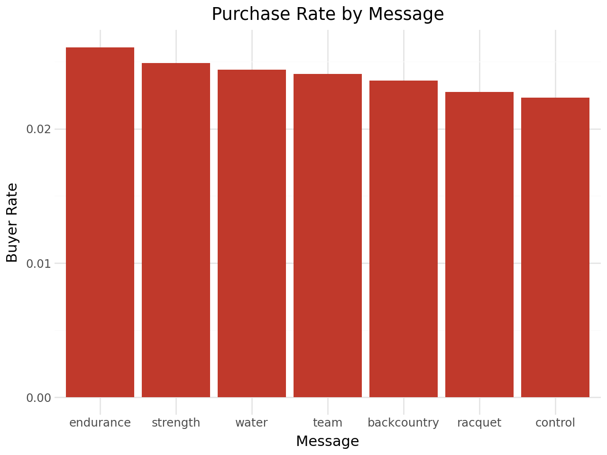
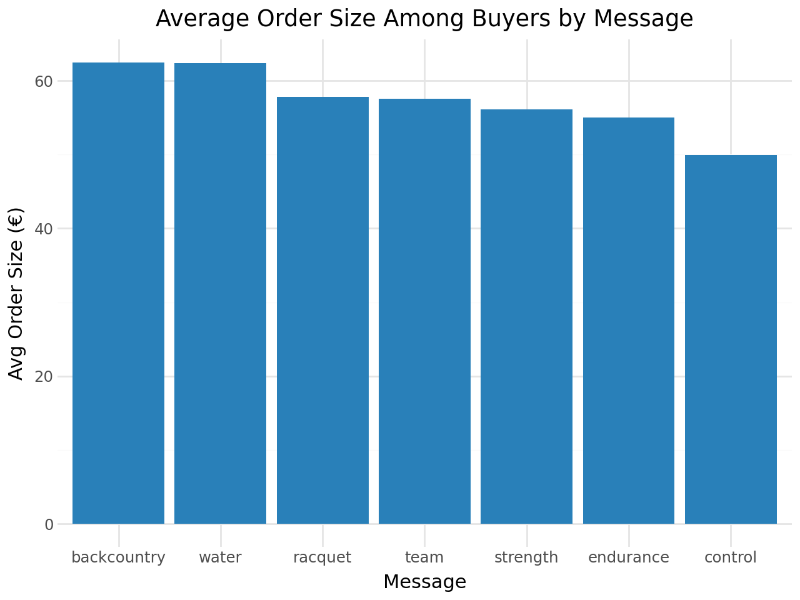
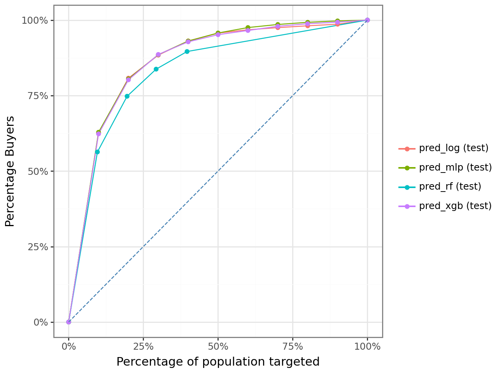
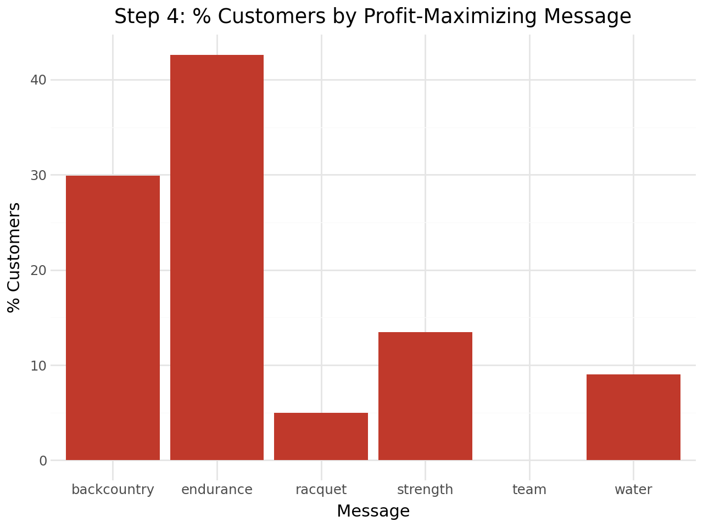

Pentathlon is a European sporting goods retailer that sends promotional messages across 7 product departments. The business question is deceptively simple: **which message should each customer receive?** With 600K customer records and 7 options per customer, brute-force one-size-fits-all targeting leaves significant profit on the table. This project builds a personalized scoring engine to maximize expected profit at the individual customer level.

---

## Data

The dataset contains 600,000 customer-message observations — each row represents one customer assigned to one of 7 promotional messages in a randomized experiment.

```python
pentathlon_nptb = pl.read_parquet("data/pentathlon_nptb.parquet")
pentathlon_nptb.head()
```

```
shape: (5, 16)
┌────────┬───────┬──────────┬─────────────┬───┬───────────┬──────────────┬──────────────┬──────────┐
│ custid ┆ buyer ┆ total_os ┆ message     ┆ … ┆ freq_team ┆ freq_backcou ┆ freq_racquet ┆ training │
╞════════╪═══════╪══════════╪═════════════╪═══╪═══════════╪══════════════╪══════════════╪══════════╡
│ U1     ┆ no    ┆ 0        ┆ team        ┆ … ┆ 4         ┆ 0            ┆ 1            ┆ 1.0      │
│ U3     ┆ no    ┆ 0        ┆ backcountry ┆ … ┆ 1         ┆ 0            ┆ 0            ┆ 1.0      │
└────────┴───────┴──────────┴─────────────┴───┴───────────┴──────────────┴──────────────┴──────────┘
```

```python
print(f"Shape: {pentathlon_nptb.shape[0]:,} rows × {pentathlon_nptb.shape[1]} columns")
# Message levels (7): endurance, strength, water, team, backcountry, racquet, control
# Train: 420,000 (70%) | Test: 180,000 (30%)
# Features (11): age, female, income, education, children,
#                freq_endurance, freq_strength, freq_water,
#                freq_team, freq_backcountry, freq_racquet
```

```
Shape: 600,000 rows × 16 columns
Message levels (7): ['backcountry', 'control', 'endurance', 'racquet', 'strength', 'team', 'water']
Train: 420,000 (70.0%) | Test: 180,000 (30.0%)
```

The experiment was properly randomized — each customer was assigned a message at random, so we can treat observed purchase outcomes as causal estimates of message effectiveness.

---

## Exploratory Data Analysis

### Purchase Rate by Message

We first look at how conversion rates vary across messages to understand whether personalization is even worth pursuing.

```python
buyer_rate = (
    pentathlon_nptb
    .group_by("message")
    .agg(pl.col("buyer01").mean().alias("buyer_rate"))
    .sort("buyer_rate", descending=True)
)

(ggplot(buyer_rate.to_pandas(), aes(x="message", y="buyer_rate"))
 + geom_col(fill="#c0392b")
 + labs(title="Purchase Rate by Message", x="Message", y="Buyer Rate")
 + theme_minimal())
```

{width=80%}

`endurance` drives the highest conversion rate, while `control` (no message) is lowest. The variation across messages is meaningful — this alone justifies personalized assignment over a single blanket strategy.

### Average Order Size Among Buyers

Conversion rate is only half the picture. We also need to know how much buyers spend.

```python
avg_os = (
    pentathlon_nptb.filter(pl.col("buyer") == "yes")
    .group_by("message")
    .agg(pl.col("total_os").mean().alias("avg_order_size"))
    .sort("avg_order_size", descending=True)
)
```

{width=80%}

The ranking **completely reverses** for order size: `backcountry` and `water` buyers spend ~€63 on average, while `endurance` buyers spend only ~€55. This is the core insight motivating a two-part model — a message can drive high conversion but low basket size, or vice versa. Optimizing on either metric alone will miss the profit-maximizing combination.

---

## Two-Part Modeling Framework

Expected profit per customer-message pair requires two models working in sequence:

$$\text{Expected Profit} = \hat{P}(\text{buy} \mid \text{message, customer}) \times \hat{E}(\text{order size} \mid \text{buyer, message, customer}) - \text{cost}$$

| Part | Task | Label | Training Set |
|---|---|---|---|
| **Part 1** | Will the customer buy? | `buyer` (yes/no) | All 420K train rows |
| **Part 2** | How much will they spend? | `total_os` | 10,080 buyers only |

---

## Part 1: Buyer Classification

We trained and cross-validated four classifiers. The logistic regression baseline helps anchor expectations:

```python
clf_log = logistic(
    data={"train": train_df},
    rvar="buyer", lev="yes",
    evar=evar_buyer,   # age, income, education, purchase frequencies + message
)
clf_log.summary()
```

```
Logistic regression (GLM)
Response variable    : buyer  |  Level: yes
Explanatory variables: age, female, income, education, children,
                       freq_endurance, freq_strength, freq_water,
                       freq_team, freq_backcountry, freq_racquet, message

┌──────────────────────┬───────┬────────┬─────────────┬───────────┬──────────┬─────────┬─────┐
│ index                ┆ OR    ┆ OR%    ┆ coefficient ┆ std.error ┆ z.value  ┆ p.value ┆     │
╞══════════════════════╪═══════╪════════╪═════════════╪═══════════╪══════════╪═════════╪═════╡
│ Intercept            ┆ 0.001 ┆ -99.9% ┆ -7.077      ┆ 0.055     ┆ -127.863 ┆ < .001  ┆ *** │
│ age[45 to 59]        ┆ 0.916 ┆ -8.4%  ┆ -0.088      ┆ 0.026     ┆ -3.38    ┆ < .001  ┆ *** │
│ income               ┆ 1.002 ┆ +0.2%  ┆  0.002      ┆ 0.000     ┆  5.21    ┆ < .001  ┆ *** │
│ freq_endurance       ┆ 1.187 ┆ +18.7% ┆  0.171      ┆ 0.006     ┆ 27.94    ┆ < .001  ┆ *** │
│ freq_backcountry     ┆ 1.163 ┆ +16.3% ┆  0.151      ┆ 0.007     ┆ 22.11    ┆ < .001  ┆ *** │
└──────────────────────┴───────┴────────┴─────────────┴───────────┴──────────┴─────────┴─────┘
```

Purchase frequency in each department is highly significant — a customer's past behavior in a category strongly predicts whether they'll respond to a promotion in that category.

We then tuned MLP, Random Forest, and XGBoost via cross-validation, selecting on **test AUC**:

```python
# Gains curves: what % of actual buyers are captured by top X% of predictions?
rsm.model.gains_plot(
    {"test": pentathlon_nptb.filter(pl.col("training") == 0)},
    rvar="buyer", lev="yes",
    pred=["pred_log", "pred_mlp", "pred_rf", "pred_xgb"]
)
```

{width=75%}

All four models lift well above the diagonal (random baseline). The gains curves are tightly clustered, with MLP pulling slightly ahead at the top deciles.

```
shape: (4, 3)
┌───────────────────────┬──────────┬──────────┐
│ Model                 ┆ CV_AUC   ┆ Test_AUC │
╞═══════════════════════╪══════════╪══════════╡
│ MLP (tuned)           ┆ 0.888941 ┆ 0.888275 │  ← selected
│ XGBoost (tuned)       ┆ 0.852270 ┆ 0.883742 │
│ Logistic Regression   ┆ —        ┆ 0.883237 │
│ Random Forest (tuned) ┆ 0.831726 ┆ 0.850096 │
└───────────────────────┴──────────┴──────────┘

✅ Best buyer model: MLP (tuned)  (Test AUC = 0.8883)
```

**Selected: MLP** — highest CV and test AUC. All models exceed 0.88, confirming that customer purchase history and demographics are strong predictors of buying behavior.

---

## Part 2: Order Size Regression

Part 2 is trained only on customers who actually purchased (10,080 train rows, 4,320 test rows):

```python
train_buyers = train_df.filter(pl.col("buyer") == "yes")
# Train buyers: 10,080 | Test buyers: 4,320

reg_rf = rforest(
    data={"train_buyers": train_buyers},
    rvar="total_os", evar=evar_os,
    mod_type="regression", **cv_best_params_reg
)
```

```
shape: (4, 4)
┌───────────────────┬──────────┬──────────┬───────────┐
│ Model             ┆ CV_R²    ┆ Test_R²  ┆ Test_RMSE │
╞═══════════════════╪══════════╪══════════╪═══════════╡
│ Linear Regression ┆ —        ┆ 0.0740   ┆ 59.78     │  ← selected
│ MLP (tuned)       ┆ 0.0585   ┆ 0.0712   ┆ 59.87     │
│ XGBoost (tuned)   ┆ 0.0461   ┆ 0.0622   ┆ 60.16     │
│ RF (tuned)        ┆ 0.0600   ┆ 0.0540   ┆ 60.42     │
└───────────────────┴──────────┴──────────┴───────────┘

✅ Best order-size model: Linear Regression  (Test R² = 0.074, RMSE = 59.78)
```

Order size is inherently noisy (R² < 0.10 for all models), which is typical in marketing — who buys is more predictable than how much they spend. Linear Regression wins on test performance despite its simplicity, again demonstrating that simpler models generalize better when signal is weak.

---

## Scoring Engine

With both models selected, we score every customer under every possible message (7 scores per customer):

```python
scored_rows = []
for msg in messages:
    scored_msg = all_customers.with_columns(pl.lit(msg).alias("message"))
    p_buy = clf_mlp_tuned.predict(scored_msg).get_column("prediction")
    p_os  = reg_lin.predict(scored_msg).get_column("prediction")
    scored_msg = scored_msg.with_columns(
        profit_hat=(p_buy * p_os - cost)
    )
    scored_rows.append(scored_msg)

# Assign each customer their profit-maximizing message
best_profit = (
    pl.concat(scored_rows)
    .group_by("custid")
    .agg(pl.all().sort_by("profit_hat").last())
)
```

### Who Gets Which Message?

The profit-maximizing assignment reveals which departments Pentathlon should prioritize:

{width=80%}

`endurance` is optimal for **43%** of customers, `backcountry` for **30%**. Notably, `team` and `control` never appear — these are universally suboptimal for every customer. This is an actionable finding: Pentathlon should reconsider the ROI of those campaign types entirely.

---

## Policy Comparison

```python
print(f"Personalized policy:   €{profit_personalized:.4f} / customer")
print(f"Best single (endurance): €{best_single_profit:.4f} / customer")
print(f"Random assignment:     €{profit_random:.4f} / customer")
```

```
Step 5 — Personalized policy avg profit/customer:    €0.6580
Step 6 — Best single message (endurance):            €0.6154
Step 7 — Random assignment avg profit/customer:      €0.5584
         No-message baseline (control):              €0.4221
```

Scaled to 5,000,000 customers:

| Policy | Avg Profit / Customer | Total Profit (5M) | vs. Personalized |
|---|---|---|---|
| **Personalized** | **€0.658** | **€3,290,000** | — |
| Best single (endurance) | €0.615 | €3,077,000 | −\€213K |
| Random assignment | €0.558 | €2,792,000 | −\€498K |
| No message (control) | €0.422 | €2,111,000 | −\€1.18M |

::: {.callout-note appearance="simple"}
## Key Results
- Personalized policy beats best single-message by **+6.47%** (+€213K at 5M scale)
- Beats random assignment by **+15.13%** (+€498K at 5M scale)
- Beats no-message baseline by **+56%** (+€1.18M at 5M scale)
- **Total projected profit: ~€3.29M** at 5M-customer scale
:::

---

## Key Takeaways

- **Two metrics, not one**: purchase rate and order size rankings differ across messages — a model must capture both to find the true profit maximum
- **Personalization compounds**: +6.47% per customer becomes €213K in aggregate at scale
- **Model simplicity wins again**: Linear Regression outperformed RF and XGBoost for order size prediction — noisy targets favor parsimony
- **Drop the losers**: `team` and `control` being universally suboptimal is a strategic signal, not just a modeling artifact

*Feb–Mar 2026 · Group 23 · Python, Polars, Scikit-learn, XGBoost, MLP*
