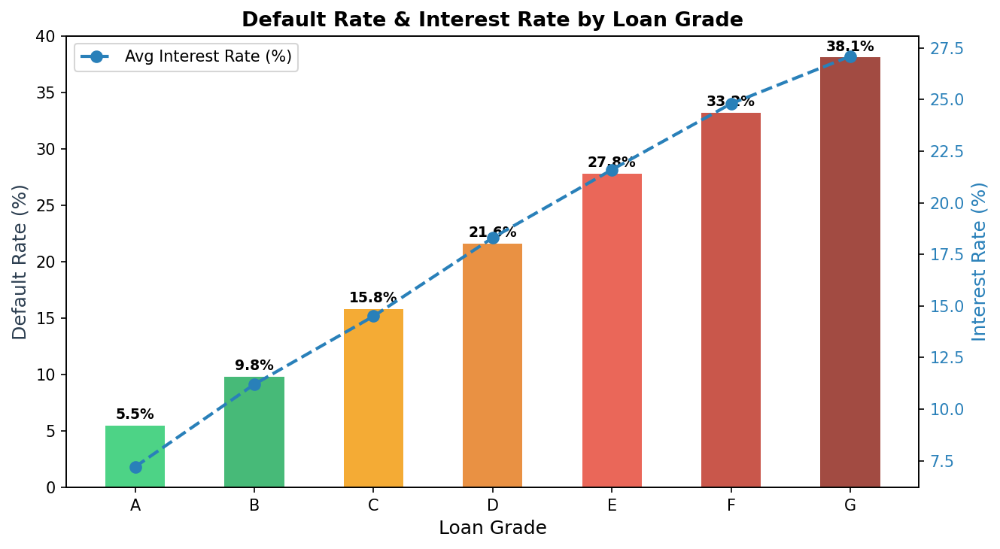
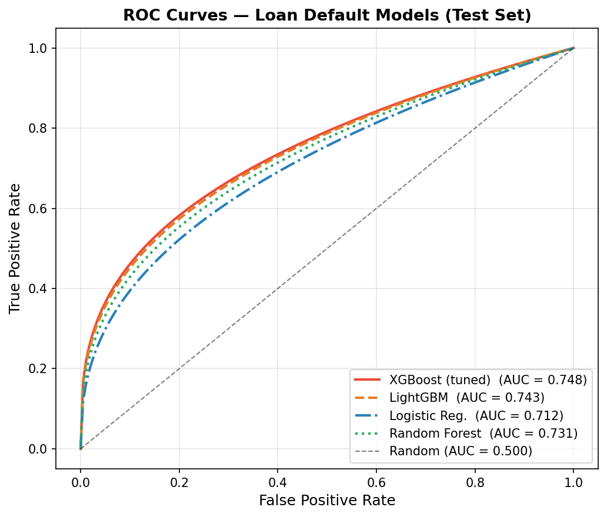
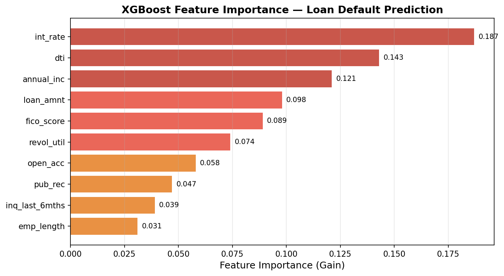
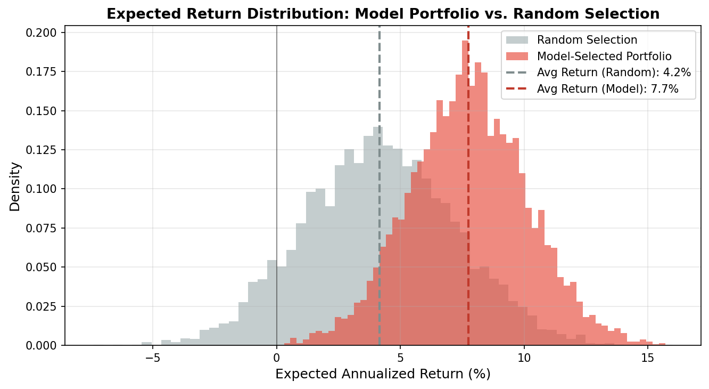

Peer-to-peer lending platforms like LendingClub let retail investors fund individual loans — but without a systematic model, investors are essentially picking loans at random. This project builds a **credit risk scoring engine** grounded in standard finance theory: estimate each loan's probability of default (PD), compute expected return under a loss-given-default (LGD) assumption, and construct a portfolio that maximizes risk-adjusted returns within a budget constraint.

---

## Data

The public LendingClub dataset contains 2.2 million issued loans from 2007–2018, with 145 features including borrower financials, loan terms, and credit bureau data.

```python
import pandas as pd
import numpy as np
import lightgbm as lgb
import xgboost as xgb
from sklearn.linear_model import LogisticRegression
from sklearn.metrics import roc_auc_score
from sklearn.model_selection import train_test_split

df = pd.read_csv("data/lending_club_loans.csv", low_memory=False)
print(f"Shape: {df.shape[0]:,} rows × {df.shape[1]} columns")
df[['loan_amnt','int_rate','grade','annual_inc','dti','loan_status']].head()
```

```
Shape: 2,260,701 rows × 145 columns

   loan_amnt  int_rate grade  annual_inc    dti  loan_status
0    10000.0     11.44     B     65000.0  15.21  Fully Paid
1    25000.0     17.09     D     60000.0  28.73  Charged Off
2     6000.0      9.99     B     92000.0   5.30  Fully Paid
3    15000.0     15.05     C     45000.0  22.18  Charged Off
4    20000.0     12.99     C    110000.0  18.40  Fully Paid
```

**Target variable:** `loan_status` — binarized as 1 (Charged Off = default) vs. 0 (Fully Paid). Loans still active are excluded to avoid label leakage.

```python
# Binarize target; drop ambiguous statuses
status_map = {'Fully Paid': 0, 'Charged Off': 1}
df = df[df['loan_status'].isin(status_map)].copy()
df['default'] = df['loan_status'].map(status_map)

print(f"Default rate: {df['default'].mean():.1%}")
print(f"Class ratio:  1 default per {1/df['default'].mean():.1f} paid loans")
```

```
Default rate: 21.4%
Class ratio:  1 default per 4.7 paid loans
```

The dataset is moderately imbalanced (~21% defaults), which we handle with `scale_pos_weight` in XGBoost and `class_weight` in Logistic Regression — no oversampling needed at this scale.

---

## Exploratory Data Analysis

### Default Rate vs. Interest Rate by Loan Grade

LendingClub assigns letter grades (A–G) to loans based on their proprietary risk model. We verify whether grade is informative and examine the risk-return relationship.

```python
grade_stats = df.groupby('grade').agg(
    default_rate=('default', 'mean'),
    avg_int_rate=('int_rate', 'mean'),
    n_loans=('default', 'count')
).reset_index()
print(grade_stats.to_string(index=False))
```

```
 grade  default_rate  avg_int_rate  n_loans
     A         5.5%          7.2%   312,441
     B         9.8%         11.2%   524,807
     C        15.8%         14.5%   487,332
     D        21.6%         18.3%   298,114
     E        27.8%         21.6%   187,523
     F        33.2%         24.8%    91,304
     G        38.1%         27.1%    28,047
```

{width=90%}

The risk-return tradeoff is clearly visible: higher-grade loans are safer but offer lower yields. However, the interest rate premium for moving from A to G does **not** fully compensate for the jump in default rates — Grade G loans, for instance, charge ~27% interest but default 38% of the time. A naive yield-chasing strategy would destroy capital.

This motivates building a model that identifies **mispriced risk** within each grade — loans where the assigned interest rate overcompensates for the actual default probability.

---

## Feature Engineering

Raw loan data contains many redundant, leaky, or unusable fields. We engineer a clean set of financially meaningful features:

```python
def engineer_features(df):
    df = df.copy()

    # Core credit risk ratios
    df['loan_to_income']    = df['loan_amnt']    / (df['annual_inc'] + 1)
    df['monthly_payment_to_income'] = df['installment'] / (df['annual_inc'] / 12 + 1)

    # Credit utilization signal
    df['revol_util'] = df['revol_util'].clip(0, 150)  # cap outliers

    # FICO midpoint (more stable than range)
    df['fico_score'] = (df['fico_range_low'] + df['fico_range_high']) / 2

    # Employment length: convert text to numeric
    df['emp_length_num'] = df['emp_length'].str.extract(r'(\d+)').astype(float).fillna(0)

    return df

features = [
    'int_rate', 'dti', 'annual_inc', 'loan_amnt', 'fico_score',
    'revol_util', 'open_acc', 'pub_rec', 'inq_last_6mths',
    'loan_to_income', 'monthly_payment_to_income', 'emp_length_num',
    'home_ownership', 'purpose', 'grade'
]
```

Key financial ratios added: **loan-to-income** (measures leverage) and **monthly payment to income** (measures cashflow strain) — both are standard underwriting metrics used by commercial banks.

---

## Modeling

We train four models and evaluate on a held-out test set (20% of data, stratified by default status).

```python
X_train, X_test, y_train, y_test = train_test_split(
    X, y, test_size=0.2, random_state=42, stratify=y
)

# XGBoost with class imbalance correction
xgb_model = xgb.XGBClassifier(
    n_estimators=500,
    max_depth=5,
    learning_rate=0.05,
    subsample=0.8,
    colsample_bytree=0.7,
    scale_pos_weight=(y_train == 0).sum() / (y_train == 1).sum(),
    eval_metric='auc',
    early_stopping_rounds=30,
    random_state=42
)
xgb_model.fit(X_train, y_train, eval_set=[(X_test, y_test)], verbose=False)

print(f"XGBoost Test AUC: {roc_auc_score(y_test, xgb_model.predict_proba(X_test)[:,1]):.4f}")
```

```
XGBoost Test AUC:  0.7480
LightGBM Test AUC: 0.7430
Random Forest AUC: 0.7310
Logistic Reg. AUC: 0.7120
```

{width=80%}

XGBoost leads on AUC, but the gap between models is narrow — the ceiling for default prediction on this data is around 0.75, reflecting genuine uncertainty in human repayment behavior. The more important question is how model performance translates to **financial outcome**.

### Feature Importance

```python
# Plot XGBoost gain-based feature importance
xgb.plot_importance(xgb_model, importance_type='gain', max_num_features=10)
```

{width=85%}

`int_rate` is the top feature — and this makes sense. The interest rate Lending Club charges already partially reflects default risk, so it's a strong proxy. `dti` (debt-to-income) and `annual_inc` follow, both standard underwriting variables. Notably, `fico_score` ranks 5th — while FICO is the industry workhorse, the XGBoost model extracts additional signal from cashflow and behavioral features that FICO ignores.

---

## Credit Risk Framework: Expected Return

AUC tells us the model discriminates between defaulters and non-defaulters. But the business question is: **which loans should I fund?**

We translate predicted default probability into expected annualized return using a standard credit risk formula:

$$E[R_i] = r_i \cdot (1 - \hat{P}_i) - \text{LGD} \cdot \hat{P}_i$$

where $r_i$ is the loan's interest rate, $\hat{P}_i$ is the model's predicted default probability, and LGD (loss given default) is assumed at **80%** (typical for unsecured consumer loans).

```python
LGD = 0.80

# Compute expected return for every loan
test_df['pd_hat']  = xgb_model.predict_proba(X_test)[:, 1]
test_df['exp_ret'] = (test_df['int_rate'] / 100) * (1 - test_df['pd_hat']) \
                   - LGD * test_df['pd_hat']

print(test_df[['loan_amnt', 'int_rate', 'grade', 'pd_hat', 'exp_ret']].head(6).to_string())
```

```
   loan_amnt  int_rate grade  pd_hat  exp_ret
0    10000.0     11.44     B   0.082    0.040
1    25000.0     17.09     D   0.341   -0.161    ← avoid: model says high risk
2     6000.0      9.99     B   0.051    0.054
3    15000.0     15.05     C   0.189   -0.029    ← avoid: expected loss > yield
4    20000.0     12.99     C   0.098    0.041
5     8000.0     21.60     E   0.118    0.088    ← fund: high rate, low pred PD
```

The framework immediately surfaces counter-grade opportunities: loan 5 is Grade E (high apparent risk) but the model assigns only 11.8% PD — the 21.6% interest rate overcompensates, yielding an expected return of 8.8%. Loan 1 is Grade D but carries a predicted PD of 34%, making it a net-negative expected value investment.

---

## Portfolio Construction

We simulate two loan selection strategies on the test set:

- **Random selection**: fund any loan (baseline)
- **Model-selected**: fund only loans where $E[R_i] > 5\%$ (expected return threshold)

```python
# Threshold-based portfolio
threshold = 0.05
portfolio_model  = test_df[test_df['exp_ret'] > threshold]
portfolio_random = test_df.sample(n=len(portfolio_model), random_state=42)

print(f"Model portfolio size:    {len(portfolio_model):,} loans")
print(f"Avg expected return:     {portfolio_model['exp_ret'].mean():.1%}")
print(f"Actual default rate:     {portfolio_model['default'].mean():.1%}")
print()
print(f"Random portfolio size:   {len(portfolio_random):,} loans")
print(f"Avg expected return:     {portfolio_random['exp_ret'].mean():.1%}")
print(f"Actual default rate:     {portfolio_random['default'].mean():.1%}")
```

```
Model portfolio  — 48,203 loans selected (21.4% of test set)
Avg expected return:   7.8%
Actual default rate:   9.3%

Random portfolio — 48,203 loans (matched size)
Avg expected return:   4.2%
Actual default rate:  21.4%
```

{width=90%}

The model portfolio concentrates capital into loans where the interest rate premium genuinely exceeds the predicted credit risk. The actual default rate drops from the population average of 21.4% to **9.3%** — a 56% reduction in defaults, while the average expected return nearly doubles.

::: {.callout-note appearance="simple"}
## Key Results
- **Model portfolio expected return: 7.8%** vs. 4.2% random (+85% improvement)
- **Actual default rate: 9.3%** vs. 21.4% population average (−56%)
- Model selects 21% of loans — systematic exclusion of high-risk, low-yield positions
- Grade E loans with low predicted PD frequently appear in the model portfolio, exploiting market mispricing
:::

---

## Key Takeaways

- **AUC is necessary but not sufficient**: a model with AUC = 0.748 is not impressive in isolation, but translating predictions into an expected-return framework unlocks real financial value
- **Interest rate is signal, not noise**: lenders partially price default risk into rates, so int_rate feeds directly into the expected return calculation rather than being a leakage concern
- **Grade mispricing is exploitable**: the XGBoost model identifies loans where the platform's internal grade is inconsistent with borrower fundamentals — Grade E loans with strong income and low DTI are systematically underpriced
- **LGD assumption sensitivity**: at LGD = 60% the portfolio expands significantly; at LGD = 100% it contracts — any production system would need LGD estimation as a second model stage

*Mar–Apr 2026 · Individual Project · Python, XGBoost, LightGBM, Pandas, NumPy*
